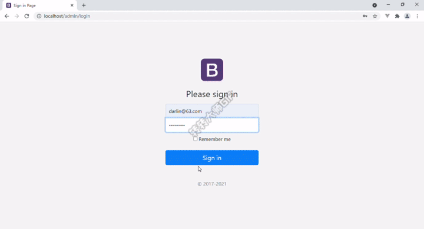

# 多人博客管理系统

### 一、简介

* 描述：

  ​        该项目是由后端渲染的多人博客管理系统，主要包括博客内容显示和博客管理两部分。博客内容显示部分有博客首页和文章详情页，提供给普通用户访问；博客管理部分包含用户管理和文章管理，提供给管理员身份的用户对用户和文章进行添加删除等操作。

* 技术栈：

  nodejs、express、mongoose、mongoDB、bootstrap、art-template等

* 实现功能：

  * 登录登出功能
  * 博客展示页面（首页）
  * 文章详情展示
  * 文章评论功能
  * 用户管理（添加、编辑和删除用户）
  * 文章管理（添加、编辑和删除文章）

* 路由表

  | 路由                  |     query/body     | 请求方法 |      功能      |
  | :-------------------- | :----------------: | :------: | :------------: |
  | /home                 |     page(页码)     |   GET    |    博客首页    |
  | /home/article         |     id(文章id)     |   GET    |   文章详情页   |
  | /home/comment         | uid、aid、content  |   POST   |      评论      |
  | /admin/login          |         --         |   GET    |      登录      |
  | /admin/logout         |         --         |   GET    |      登出      |
  | /admin/users          |        page        |   GET    |   用户列表页   |
  | /admin/user-edit      | id(要编辑的用户id) |   POST   | 用户添加或编辑 |
  | /admin/user-delete    |       用户id       |   GET    |    用户删除    |
  | /admin/article-list   |        page        |   GET    |   文章列表页   |
  | /admin/article-add    |         --         |   POST   |    添加文章    |
  | /admin/article-edit   |       文章id       |   POST   |    编辑文章    |
  | /admin/article-delete |       文章id       |   GET    |    删除文章    |

  

### 二、运行截图

* 普通用户

  1. 访问首页和文章详情页

     

  2. 评论和退出登录功能

     

* 管理员

  1. 登录访问后台管理系统

     

  2. 文章管理

     

### 三、项目运行

1. 连接mongoDB数据库
2. 在命令行窗口输入：`node app.js`
3. 在浏览器访问 `http://localhost:80`

